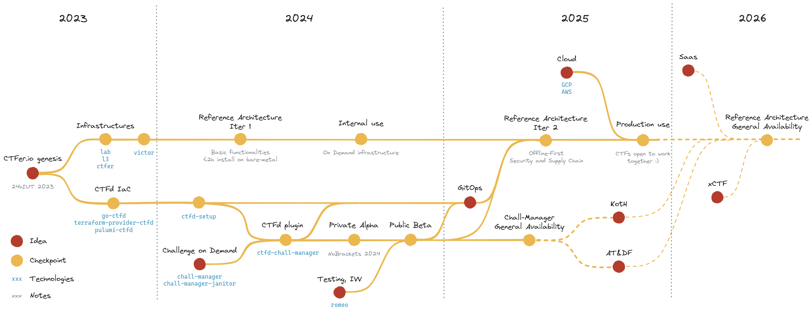

{}

CTFer.io is a **Free**, **Open-Source**, and **Community-driven** effort to bring the cybersecurity efforts of teaching, training and competitions further.

{}

{}
## Why ?

Why does CTFer.io exist ? Doesn't tooling, platforms and others already exist ?

Yes, but none as succeeded to build a _Reference Architecture_ for a CTF event, and solve common problems:
- Challenge on Demand
- KotH
- Attack & Defense
- Automation of CTF infrastructure installation, replicability, maintenance, update, etc.
- Company-grade code quality, security, resilience, documentation, monitoring, etc.
- others...

In 2023, we were asked to create a cybersecurity event in less than 50 days, with barely no knowledges and insufficient skills for challenges.
We had to think and act quickly, which led us to previous work of the [BreizhCTF 2023](https://github.com/BreizhCTF/breizhctf-2023). For challenges, we were helped by the [MILF CTF Team](https://milfctf.com/).
It was a total success, but through the build and run of the event, we saw plenty room for improvement. We decided to share our previous and new knowledges with the community.

That is the genesis of CTFer.io, the effort to bring the community together in order to improve, openly, and for free.

{}

{}
## What ?

Most problems comes from a lack of **technologies or code quality**. That is easily solved with our _Software Development Plan_ focused on creating tooling in mostly 2 languages (Golang and Typescript). Those languages have strong advantages (e.g., strongly-typed, covers backend and/or frontend, highly supported, security) that we build upon.
When necessary, we are open to work with other languages, but prefer not to. This strategy helps us mastering ecosystems rather than knowing lots of them, hence propose the best solutions to various situations.
Our goal is to architect solutions in a platform-agnostic way such that we do not vendor lock in.

Other problems originates from **scientific limitations**. We tackle them experimentally, one at a time, and validate our results by pseudo-structured dicussions, peer-reviews, in-lab and in-production experimentations.
For now, we did not publish in scientific litterature, but plan to.

Every contribution we work on is first developed and tested internally, then publicly released under **Apache-2.0 License** when we are confident enough (tested in a production environment). Individuals, agencies and companies are invited to adopt them and contribute back (issues and pull requests).

Those fits a combination of our core aspects:
- Infra as Code for tooling, replicability...
- Software Development to solve technological limitations
- Research & Development to tackle actual and scientific problems

  

{}

{}
## For whom ?

Our work helps the whole community:
- **Players** through new capabilities and flavors of challenges.
- **ChallMakers** by providing them solutions to common problems: testing, replicability, ease of deployment, new capabilities for challenges.
- **Ops** through tooling, Infra as Code, documentation and monitoring.
- **Admins** by documenting the goal of each actor in a CTF, where does the community stands, what are the current problems, etc.

We focus on Infrastructure for you, so you can use your time on the actual value of your CTF: community, _Artistic Direction_, talks, sponsors...

As you might not be DevOps, we propose simple APIs: integrations in existing frontends, YAML files or CLI configurations. We work as much as possible on lowering the bar of skills required to run a CTF.

Furthermore, we are open to discuss with the community, whatever role above you fit into: we can shape the future of CTFs with your help.
{}
